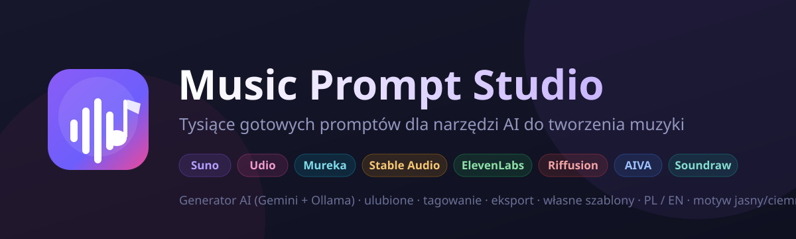
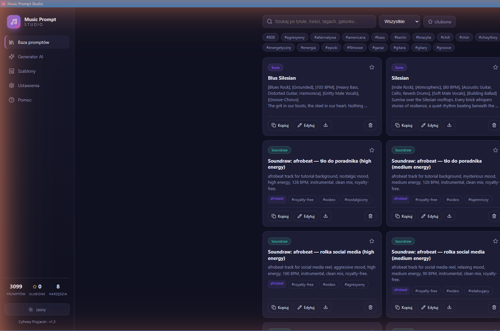
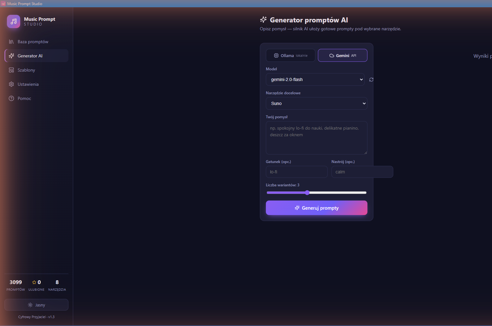
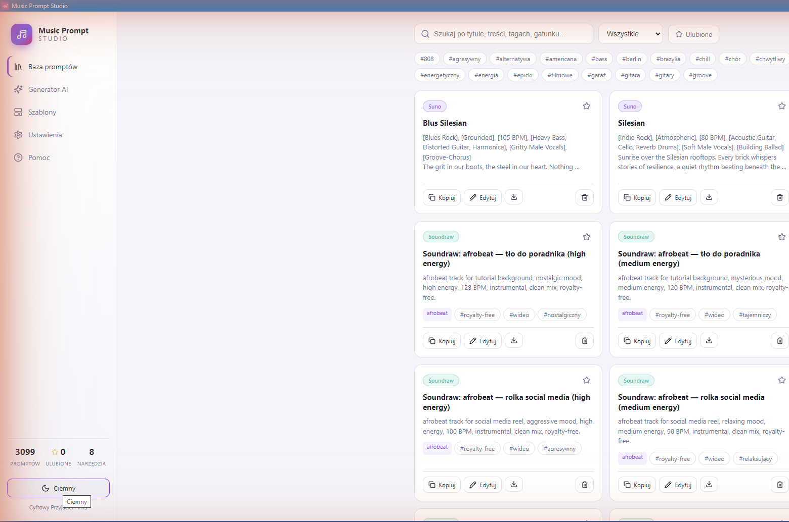

<p align="center">
  
</p>

<p align="center">
  <a href="https://github.com/zetmar-collab/music-prompt-studio/releases/latest"></a>
  <a href="https://github.com/zetmar-collab/music-prompt-studio/releases"></a>
  
  
  
</p>

<h1 align="center">🎵 Music Prompt Studio</h1>

<p align="center">
  <b>Ponad 3000 gotowych promptów</b> dla narzędzi AI do tworzenia muzyki — plus generator promptów oparty o AI.<br>
  Zamiast e-booka: wygodna wyszukiwarka, generator i własne szablony w jednej aplikacji desktopowej.
</p>

---

## ⬇️ Pobierz

<p align="center">
  <a href="https://github.com/zetmar-collab/music-prompt-studio/releases/latest">
    
  </a>
</p>

1. Wejdź na **[stronę najnowszego wydania](https://github.com/zetmar-collab/music-prompt-studio/releases/latest)**.
2. Pobierz plik **`Music-Prompt-Studio-Setup-*.exe`**.
3. Uruchom instalator — instalacja **per-user** (bez uprawnień administratora), skróty w Menu Start i na pulpicie.

> Aplikacja od razu wypełnia lokalną bazę tysiącami promptów — nie musisz nic konfigurować, żeby zacząć.

---

## ✨ Funkcje



| | |
|---|---|
| 📚 **Baza promptów** | Ponad 3000 promptów dla **8 narzędzi**, pełnotekstowa wyszukiwarka (SQLite) |
| ✨ **Generator AI** | Dwa silniki: **Gemini API** (chmura) i **Ollama** (lokalnie, offline, za darmo) |
| ⭐ **Ulubione** | Oznaczaj i filtruj najlepsze prompty |
| 🏷️ **Tagowanie** | Chmura tagów, filtrowanie jednym kliknięciem |
| 📤 **Eksport** | Masowy i pojedynczy: JSON, CSV, Markdown, TXT |
| 🧩 **Własne szablony** | Pola `{placeholder}` składane w gotowy prompt |
| 🌍 **PL / EN** | Pełne tłumaczenie interfejsu, przełączane w locie |
| 🌗 **Motyw jasny/ciemny** | Przełącznik w pasku bocznym i w ustawieniach |
| ⌨️ **Skróty klawiaturowe** | Szybka nawigacja i akcje |
| 🔄 **Auto-update** | Wykrywa nowe wydania na GitHubie |

### Obsługiwane narzędzia
**Suno** · **Udio** · **Mureka** · **Stable Audio** · **ElevenLabs** · **Riffusion** · **AIVA** · **Soundraw**

Generator zna specyfikę każdego z nich i formatuje prompty odpowiednio (np. tagi `[ ]` dla Suno, format loop dla Stable Audio, kompozycje instrumentalne dla AIVA).

### 🖼️ Zrzuty ekranu

| Generator AI | Motyw jasny |
|:---:|:---:|
|  |  |

---

## 🤖 Silniki AI

| Silnik | Opis |
|---|---|
| **Ollama** (domyślny) | Działa **lokalnie i offline**, bez kosztów. Zainstaluj [Ollama](https://ollama.com), uruchom `ollama serve`, pobierz model: `ollama pull llama3.2`. |
| **Gemini** (chmura) | Pobierz klucz w [Google AI Studio](https://aistudio.google.com/app/apikey) i wklej w **Ustawieniach**. Klucz przechowywany jest **lokalnie** i nigdy nie opuszcza urządzenia. |

---

## ⌨️ Skróty klawiaturowe

| Skrót | Działanie | Skrót | Działanie |
|---|---|---|---|
| `Ctrl+1/2/3` | Baza / Generator / Szablony | `Ctrl+N` | Nowy prompt |
| `Ctrl+,` | Ustawienia | `Ctrl+Enter` | Generuj |
| `Ctrl+F` | Szukaj | `F1` / `?` | Pomoc |
| `Esc` | Zamknij okno | | |

---

## 🛠️ Dla deweloperów

| Warstwa | Technologia |
|---|---|
| Powłoka | Electron 33 |
| UI | React 18 + TypeScript + Vite |
| Baza | better-sqlite3 (lokalny plik) |
| AI | Gemini API (`@google/genai`) + Ollama REST |

```bash
npm install        # instalacja zależności
npm run dev        # tryb deweloperski
npm run dist       # zbuduj instalator Windows (Inno Setup) do dist/
```

Wydania publiczne buduje automatycznie **GitHub Actions** przy pushu tagu `v*` (patrz [`.github/workflows/release.yml`](.github/workflows/release.yml)).

---

## 📜 Historia zmian

Zobacz **[CHANGELOG.md](CHANGELOG.md)** · Pełna pomoc: **[docs/POMOC.md](docs/POMOC.md)** ([English](docs/HELP.md))

---

<p align="center">
  © 2026 <b>Marek Zettel</b> · Cyfrowy Przyjaciel · Licencja MIT
</p>
